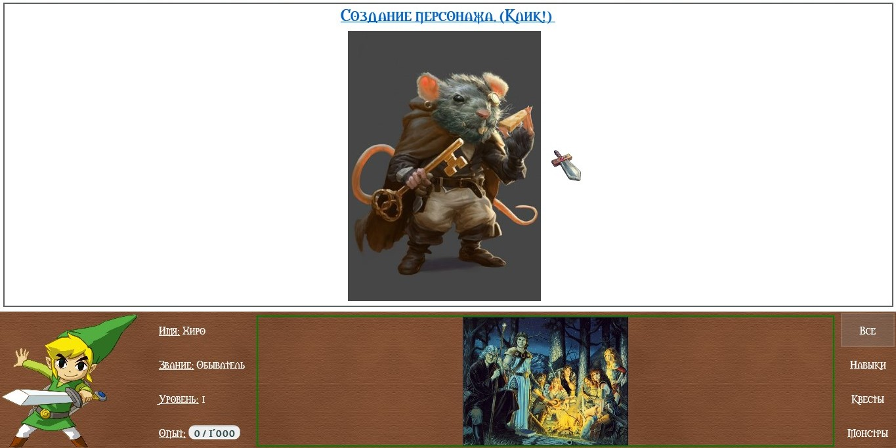

# РПГ Органайзер: PC версия

Это исходный код десктопной версии [программы РПГ Органайзер](http://nerdistway.blogspot.com/2013/07/mylife-rpg-organizer.html).

**РПГ Органайзер это…**

**С одной стороны - необычный таск-менеджер (ToDo List)**, в том плане, что ты назначаешь себе задания и выполняешь.

**С другой - игра**, нацеленная на самосовершенствование.

**РПГ Органайзер это инструмент** для самосовершенствования, организации режима дня и достижения баланса.

Создай персонажа, олицетворяющего тебя. Настрой способности, придумай увлекательные квесты и выполняй действия, повышающие твой уровень!

**РПГ Органайзер** - продвинутый гибрид ToDo списка и ролевой компьютерной игры.

Аналоги:

- [Habitica](https://habitica.com/static/home)
- [Life RPG](https://play.google.com/store/apps/details?id=com.jayvant.liferpgmissions&hl=en)
- [Epic Win](https://play.google.com/store/apps/details?id=com.supermono.epicwin&hl=ru)
- [RPG Organizer Web](http://nerdistway.blogspot.com/2013/07/mylife-rpg-organizer.html)

## Как осуществлять разработку

Склонируй к себе на комьютер репозиторий. Воспользуйся **Visual Studio**, вооружись знаниями **C#** и **WPF**. Запусти приложение нажав **F5**... Начало программы в **MainWindow.cs**. Дерзай!